# 🚀 Enable secure S3 Access from an EC2 Instance using IAM and AWS CLI
This project configures secure communication between an Amazon EC2 instance and an S3 bucket using only an IAM user with limited S3 and EC2 permissions — and all through the AWS CLI.

## 🔐 Key Steps overview
- Created a least-privilege IAM user with custom S3 and EC2 permissions.
- Created an EC2 instance with minimal free tier configuration.
- Created a S3 bucket and uploaded any file on it.
- Created Access key for the IAM user.
- Set up AWS CLI credentials securely on the EC2 instance.
- Verified access and enabled data operations using commands like aws s3 ls, aws s3 cp

## 🔧 Implementation
### Create an IAM User(named AWS-User) with required least privileges
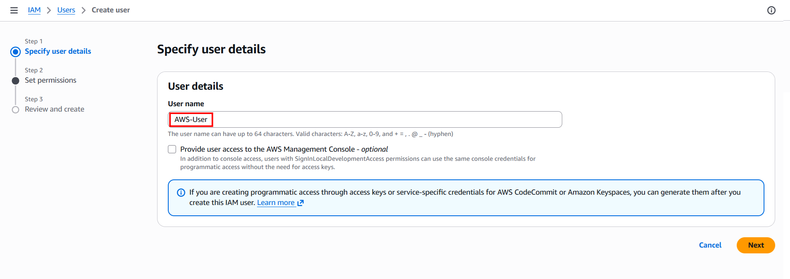
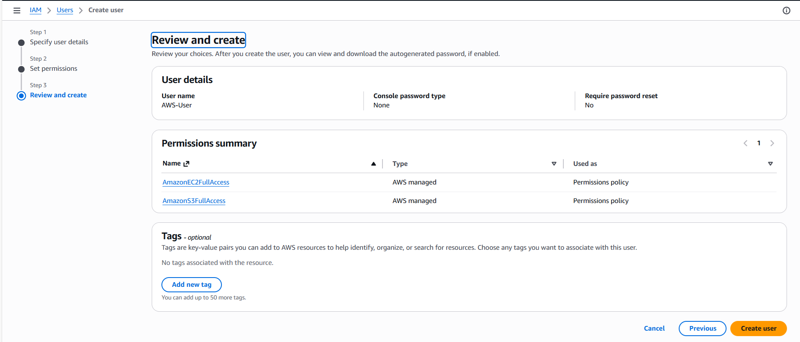
### Create an EC2 Instance(named AWS-Instance with default settings)
Note: : Choose Ubuntu AMI for the EC2 instance
### Create a S3 bucket
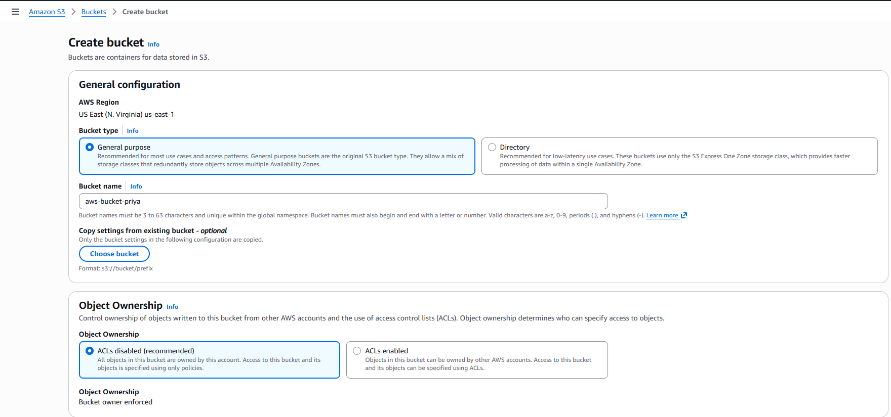
Note: **Block Public Access settings for this bucket** should be disabled
### Upload the file into S3 bucket
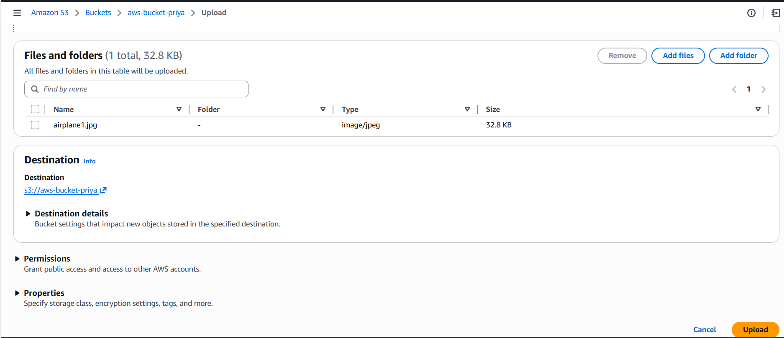
### Create Access key
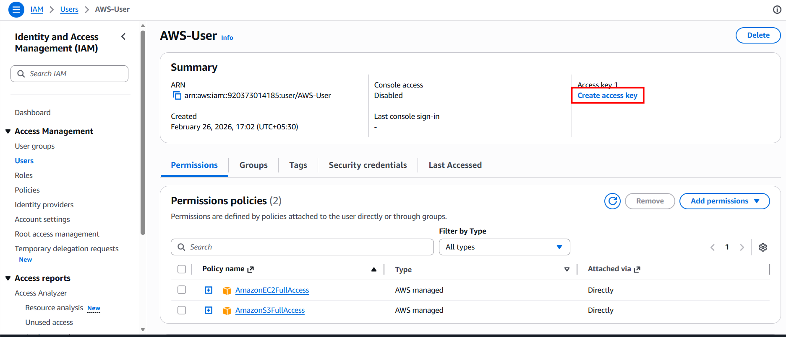
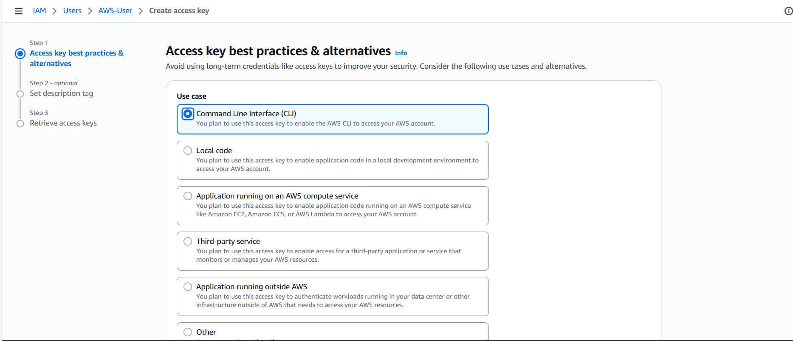
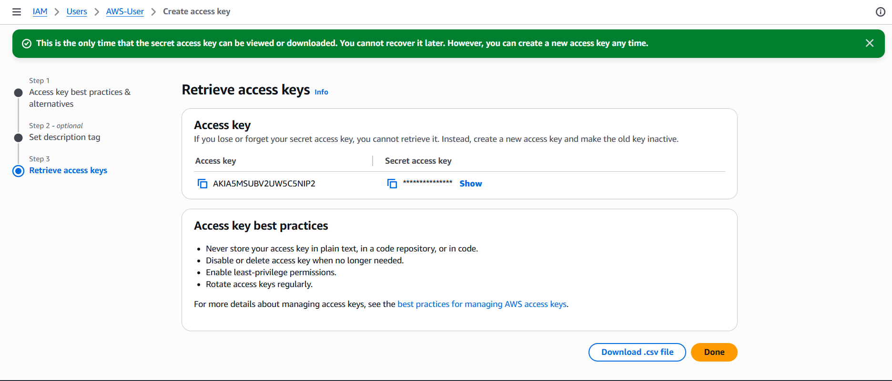
### Open terminal and connect to EC2 instance
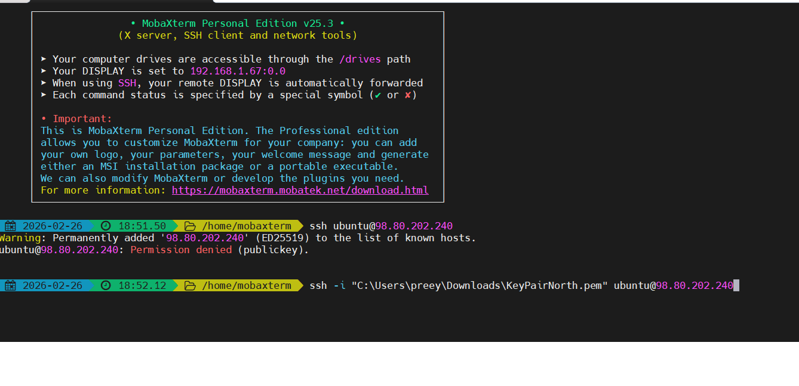
### Run the following code
```
sudo apt update
sudo apt install unzip

curl "https://awscli.amazonaws.com/awscli-exe-linux-x86_64.zip" -o "awscliv2.zip"
unzip awscliv2.zip
sudo ./aws/install
```

Note: check AWS version using **aws --version**


### Setup AWS credentials using **aws configure**
Enter the access key and secret access key here that was fetched from AWS console


### Verify the access using aws commands
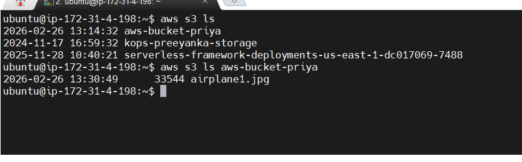

#### Copy the files in S3 to local(EC2 instance)
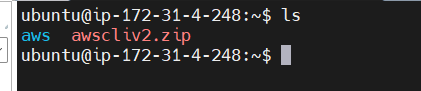
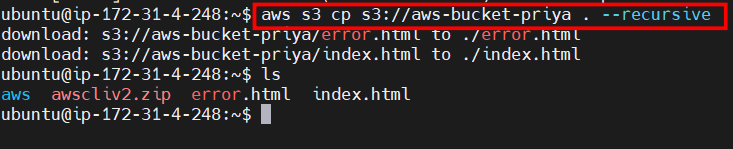

Copy the content of local EC2 to S3: `aws s3 cp filename s3://bucketname`


Sync the data between local EC2 and S3: 
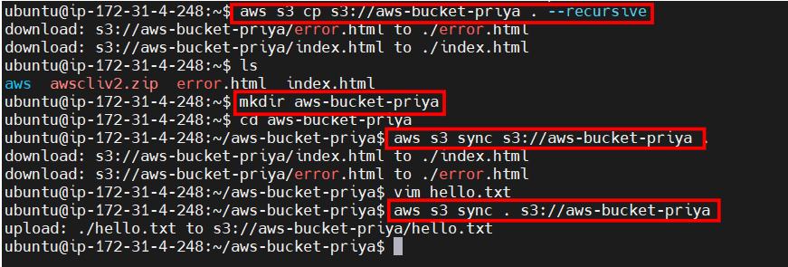


This way we can upload the files in EC2 to S3 directly.

## It is a great hands-on exercise in IAM, EC2, S3, and AWS CLI, reinforcing how important secure and minimal-access configurations are in cloud engineering.


