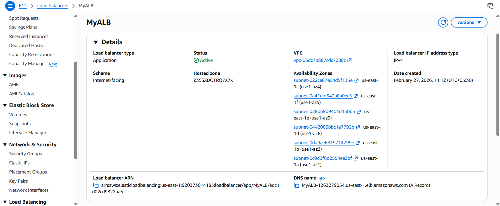
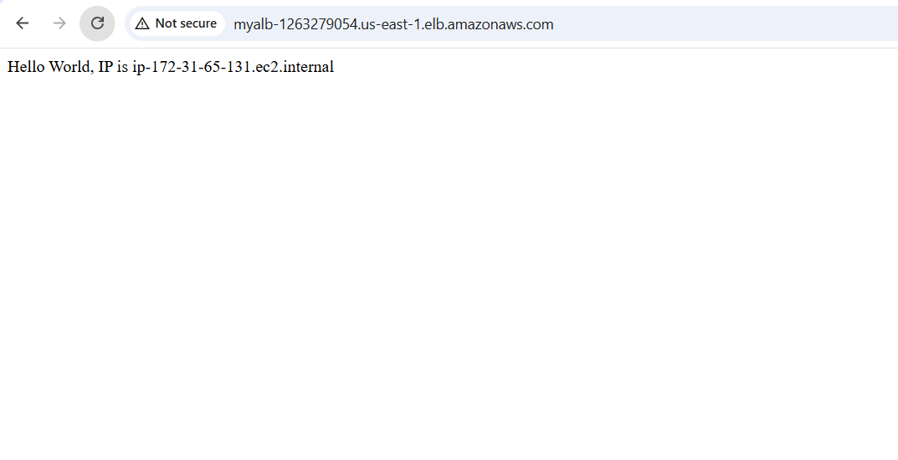

# 🚀 Deploy a Scalable Web Application Using AWS Auto Scaling & Application Load Balancer (ALB)

This project deploys a fully scalable and highly available web application on AWS using an Auto Scaling Group (ASG) integrated with an Application Load Balancer (ALB). This setup ensures that the application automatically adjusts capacity based on traffic while maintaining continuous availability.


## 🔐 Key Steps overview
- Created a Launch Template to standardize EC2 configuration and automate app deployment
  - Defined AMI, instance type, OS, security groups, and user-data script for automatic application deployment on every EC2 instance.
 
    
- Set up an Auto Scaling Group to manage instance scaling during peak and low traffic
  - Attached the launch template.
  - Set the minimum, maximum, and desired number of EC2 instances.
  - Enabled dynamic scaling based on CPU utilization (or custom metrics).
  - Ensured new instances register automatically to the Target Group.
 
    
- Configured an Application Load Balancer to distribute incoming traffic efficiently
  - Created an ALB to distribute incoming HTTP/HTTPS requests.
  - Defined listeners and rules to route traffic to the appropriate Target Group.
 
  
- Integrated a Target Group for dynamic instance health checks and routing
  - All instances in the ASG automatically register to the Target Group.
  - ALB routes traffic only to healthy instances.
  - Works seamlessly during scale-in or scale-out events.

 
- Successfully tested End-to-End Deployment
  - Verified web page accessibility through the ALB DNS URL.
  - Simulated load to confirm instance scale-out.
  - Tested instance termination to confirm ALB routes traffic to healthy instances only.


## 🔧 Implementation
### Step 1: Create security groups : SG-LB and SG-ASG
#### For SG-LB (Security group for load balancer)
Set inbound rules as follows:
- HTTP/80 from anywhere 0.0.0.0/0
- HTTPS/443 from anywhere 0.0.0.0/0
- SSH/22 from anywhere 0.0.0.0/0

Set outbound rules as follows:
- HTTP/80 to SG-ASG
- HTTPS/443 to SG-ASG
- SSH/22 to SG-ASG

#### For SG-ASG (Security group for Auto Scaling Group)
Set inbound rules as follows:
- HTTP/80 from SG-LB
- HTTPS/443 from SG-LB
- SSH/22 from anywhere 0.0.0.0/0


Set outbound rules as follows:
- HTTP/80 to anywhere 0.0.0.0/0
- HTTPS/443 to anywhere 0.0.0.0/0
- SSH/22 to anywhere 0.0.0.0/0


### Step 2: Create Launch Template(Named MyTemplate)
For EC2 User Data Script, use the following code
```
	#!/bin/bash
	
	sudo apt update -y
	sudo apt install nginx -y
	
	sudo cat <<EOF > /var/www/html/index.html
	Hello World, IP is $(hostname -f)
	EOF
	
	sudo systemctl enable nginx
	sudo systemctl restart nginx
```

### Step 3: Create Load Balancer(named MyLB) and Target Group(named MyTG)
We cannot attach ALB directly to ASG. Hence we need a Target Group.

Also, load balancer scheme must be Internet-facing, not internal. Thr Internet-facing scheme gives URL that can be publicly accessed.

<br>
<br>
Note: Disable the health checks for ELB, since if your ASG is using an ELB/ALB health check, even one failed check can make it terminate the instance.

### Step 3: Create Auto Scaling Group(named MyASG)
- Choose Launch Template or Configuration
	- Name: MyASG
   	- Launch Template: MyTemplate
   	- Version: 2
 
   
- Choose Instance Configuration
  Define which AZ and Subnets your ASG can use in the chosen VPC (Select all)

  
- Configure Advanced Options


- Configure Group size and scaling
  	- Desired: 1, Minimum- 1, Maximum- 5
  	- Automatic Scaling: Target Tracking Scaling policy
  	- Metric type: Average CPU Utilization
  	- Target Value: 20
  	- Instance Warmup: 30 secs

 
When multiple users hit the same server, the application or the server slows down or crashes. Hence, we require the instances to multiply by itself when traffic spikes. That is known as Auto Scaling. 

However, users knows only one IP address. So the users hit the request on one point(Load Balancer URL) and the load balancer decides to which instance in the Auto Scaling Group, the traffic must redirect.

### Step 4: Verify if the application is running by hitting the following URL
`
MyALB-1263279054.us-east-1.elb.amazonaws.com
`

###  Key Outcome:
- Automatic scaling (scale in / scale out)
- Fault-tolerant and highly resilient application architecture



### Quick fix: 
Deleting the ASG also terminates the instances associated with it.


## This project strengthens the practical understanding of AWS infrastructure, high availability design, and real-world cloud deployment workflows.


