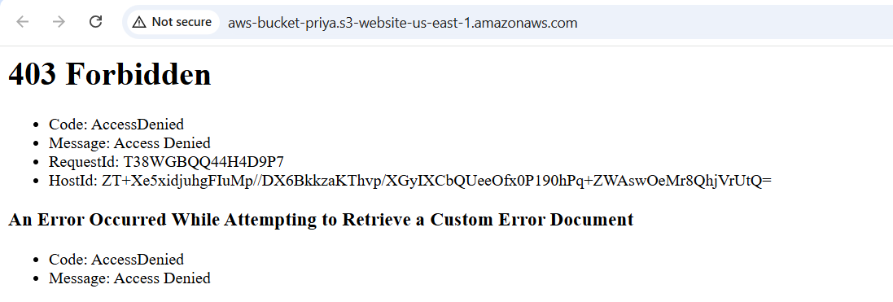
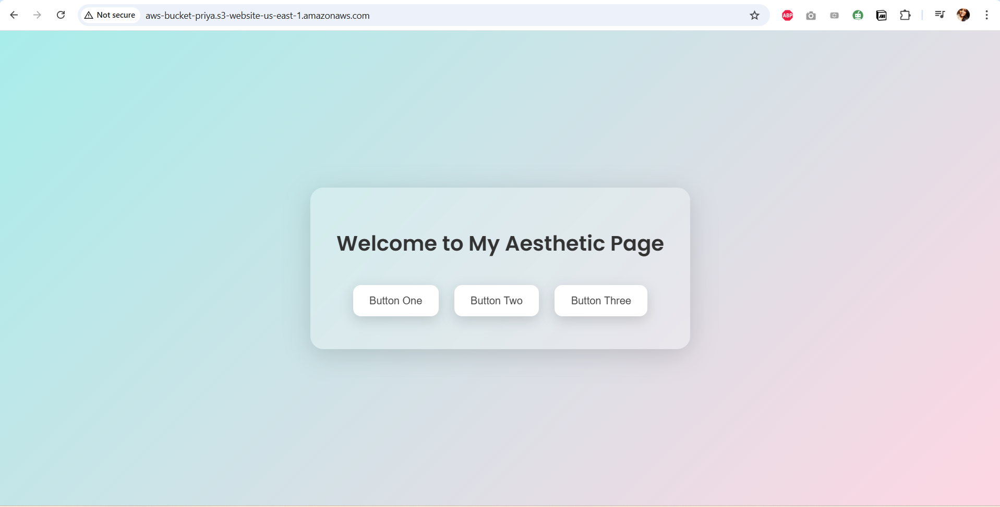

# 🚀 Deploy a static website in AWS using Amazon S3 and CoudFront
This project hosts a static website on Amazon S3 and delivers it globally through Amazon CloudFront.

## 🔐 Key Steps overview
- Created an S3 bucket for static content
- Set up a CloudFront distribution with S3 as the origin
- Selected the recommended option to allow private S3 access (CloudFront automatically created the Origin Access Control — love how seamless this is now!)
- Applied the required bucket policy for secure access
- Configured CloudFront settings for smooth and efficient content delivery


## 🔧 Implementation
### Step 1: Create a s3 bucket and upload your web pages
### Step 2: Go to Bucket properties -> Static Website Hosting -> Enable
- Hosting type: Host a static website
- Index document: index.html
- Error document: error.html
- Redirection rules: Find the below code snippet
```
[
    {
        "Condition": {
            "KeyPrefixEquals": "home/"
        }
        "Redirect": {
            "ReplaceKeyPrefixWith": "index.html"
        }
    }
]
```
Save changes, we will get a website URL: `http://aws-bucket-priya.s3-website-us-east-1.amazonaws.com/` 
<br>
Hit the URL, we will receive 403 Forbidden: Access Denied error.
<br>

<br>
We need to attach Read/GetObject policy to the bucket.
<br>
### Step 3: Attach GetObject policy to the bucket
Go to Permissions -> Bucket Policy -> Edit -> Paste the below code snippet
```
{
    "Version": "2012-10-17",
    "Statement": [
        {
            "Sid": "PublicReadGetObject",
            "Effect": "Allow",
            "Principal": "*",
            "Action": "s3:GetObject",
            "Resource": "arn:aws:s3:::aws-bucket-priya/*"
        }
    ]
}
```
### Step 4: Hit the Se3 Bucket endpoint



## It is a great hands-on exercise in IAM, EC2, S3, and AWS CLI, reinforcing how important secure and minimal-access configurations are in cloud engineering.


