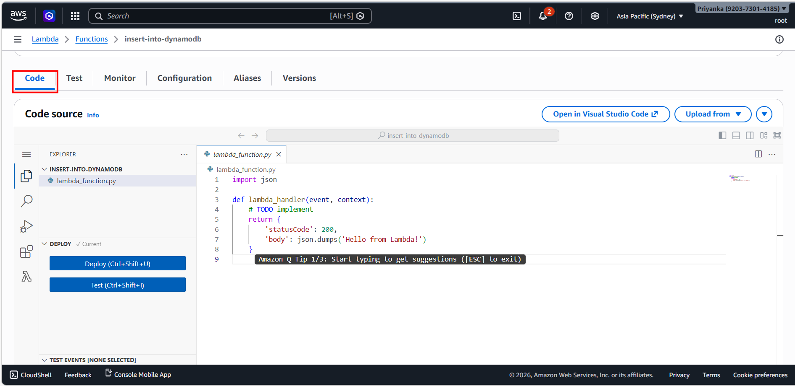

# 🚀 Serverless CRUD Project: Connecting AWS Lambda with DynamoDB (Python)

This project integrates AWS Lambda with Amazon DynamoDB to perform insert, fetch, and delete operations using Python. This project helps us understand how serverless compute and NoSQL databases work together in AWS.

## 🔐 Key Steps overview
- Created a DynamoDB Table
- Built Lambda functions using Python runtime
- Configured IAM Role for Lambda
- Wrote the Lambda code using Boto3
- Created structured test events
- Deployed and performed end-to-end testing


## 🔧 Implementation
### Step 1: Create a DynamoDB Table
- Table Name: learners
- Partition Key: learner_id
- Table Settings: Default Settings

### Step 2: Review the table
Click on Table -> Explore table items -> No items to display

### Step 3: Build Lambda functions for inserting and deleting data using Python Runtime
Add data to the table using Lambda. Lambda is basically a function. EC2 service/server creation is not required, hence it is cost-effective and serverless approach. 
- Function name: insert-into-dynamodb(for insert) and delete-from-dynamodb(for delete)
- Runtime: Python 3.14

### Step 4: Create an IAM Role(named lambda-to-access-dynamodb)
- Use Case: Lambda
- Permission Policies: AmazonDynamoDBFullAccess and CloudWatchEventsFullAccess

### Step 5: Assign role to the Lambda Function
Search Lambda -> Select desired Lambda function -> Goto Configuration -> Permissions(on left) -> Execution Role -> Edit

Select "lambda-to-access-dynamodb" -> Save

### Step 6: Write code in the function
Click on Code



#### Code for inserting data
```
import json
import boto3
def lambda_handler(event, context):
    #Establish connection to DynamoDB resource
    dynamodb = boto3.resource('dynamodb')
    #Get the table learners
    table = dynamodb.Table('learners')
    
    #Insert into table
    items_to_insert = {
        'learner_id': event["learner_id"], 
        'learner_name': event["learner_name"], 
        'learner_location': event["learner_location"]
        }
    try:
        response = table.put_item(Item=items_to_insert)
        return {
            'statusCode': 200,
            'body': json.dumps('Item inserted successfully!')
        }
    except Exception as e:
        return {
            'statusCode': 500,
            'body': json.dumps('Error inserting item: ' + str(e))
        }

    # TODO implement
    return {
        'statusCode': 200,
        'body': json.dumps('Hello from Lambda!')
    }
```

#### Code for deleting data
```
import json
import boto3
def lambda_handler(event, context):
    #Establish connection to DynamoDB resource
    dynamodb = boto3.resource('dynamodb')
    #Get the table learners
    table = dynamodb.Table('learners')
    
    #Delete from table
    key_to_delete = {
        'learner_id': event["learner_id"] 
        }
    try:
        response = table.delete_item(Key=key_to_delete)
        return {
            'statusCode': 200,
            'body': json.dumps('Item deleted successfully!')
        }
    except Exception as e:
        return {
            'statusCode': 500,
            'body': json.dumps('Error deleting item: ' + str(e))
        }

    # TODO implement
    return {
        'statusCode': 200,
        'body': json.dumps('Hello from Lambda!')
    }
```

### Step 7: Create Test Events
Code is tested through events in Lambda.

Click on Test -> Configure test event

- Test event action: Create new event
- Event name: insert-event(for insert) and delete-event(for delete)
- Event sharing settings: Private

### Step 8: Deploy and perform end-to-end testing
We don't want to hard-code the data, so we edit the event in the form of Event JSON. The event JSON contains the input data sent to the Lambda function when it is triggered. It tells the function what happened and what data to process.

- Event JSON:
  For inserting data
  ```
  {
    "learner_id": "1",
    "learner_name": "Priyanka",
    "learner_location": "Bangalore"
  }
  ```

  For deleting data
  ```
  {
    "learner_id": "1"
  }
  ```
### Expected Output


  
## It is a great hands-on exercise in IAM, EC2, S3, and AWS CLI, reinforcing how important secure and minimal-access configurations are in cloud engineering.


