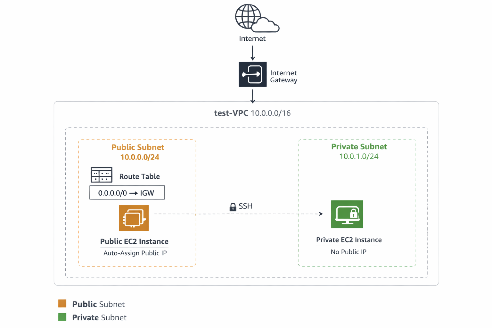
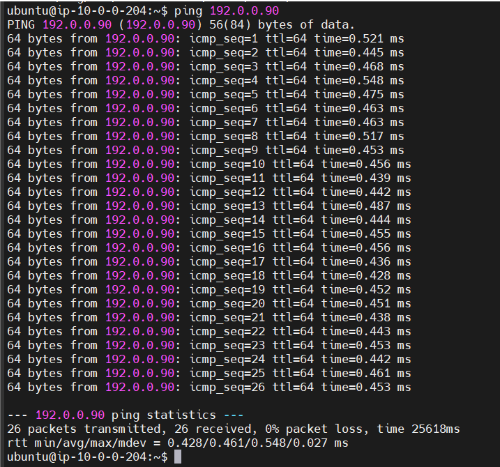

# 🚀 Implement VPC from scratch and enable VPC peering between two VPCs
This project demonstrates how to design and implement a custom Virtual Private Cloud (VPC) architecture in AWS from scratch. It covers the core networking components required to build a secure and scalable cloud environment. This project also establishes secure communication between two separate VPCs by configuring VPC peering, updating route tables, and validating connectivity across instances, ensuring seamless inter-VPC traffic flow without internet exposure.

The goal of this project is to understand how AWS networking works by manually configuring each component instead of using automated wizards.

## 🔐Architecture overview
The setup includes:
- Custom VPC
- Public Subnet
- Private Subnet
- Internet Gateway
- Route Tables
- Security Groups
- EC2 Instances

This architecture allows public internet access for one instance while keeping another instance private and secure.

## 💡Architecture Diagram

## 🔧 Implementation
### Step 1 : Create an Custom VPC

VPC is an AWS service that allows us to create a virtual private cloud for isolation and security. The size of VPC is defined by CIDR block.

Create a VPC with the following configuration:
- Name: test-vpc
- IPv4 CIDR block: IPv4 CIDR manual input
- IPv4 CIDR: 10.0.0.0/16
- IPv6 CIDR block: No IPv6 CIDR block
- Tenacy: Default

### Step 2 : Create Public Subnet

The concept of subnet divides the entire network into parts- e.g. we can have web server in  public subnet which can be accessed publicly, where as the application server or database can reside in private subnet. The user is given access of only the public subnet, not the private subnet. Resources in the private subnet can only be accessed from the public subnet of that network.

Create public subnet with the following configuration:

- VPC ID: test-vpc
- Subnet Name: test-public-subnet
- AZ: us-east-1a
- IPv4 VPC CIDR block: 10.0.0.0/16
- IPv4 Subnet CIDR block: 10.0.0.0/24

### Step 3: Create Private Subnet
- VPC ID: test-vpc
- Subnet Name: test-private-subnet
- AZ: us-east-1b
- IPv4 VPC CIDR block: 10.0.0.0/16
- IPv4 Subnet CIDR block: 10.0.1.0/24

### Step 4: Luunch an EC2 Instance (named test-instance)
Network Settings:
- VPC: test-vpc
- Subnet: test-public-subnet
- Auto assign public IP: Enable
- Security groups: SSH, HTTP-> Custom: Source- 10.0.0.0/16 (test-vpc-CIDR block)

Connect to the EC2 instance from outside world, unable to establish connection. Hence, create an Internet Gateway.

### Step 5: Create Internet Gateway

Users cannot directly connect to the public subnet. There must be an Internet Gateway. 
An internet gateway enables resources in the public subnets (such as EC2 instances) to connect to the internet if the resource has a public IPv4 address or an IPv6 address. Similarly, resources on the internet can initiate a connection to resources in the subnet using the public IPv4 address or IPv6 address. For example, an internet gateway enables us to connect to an EC2 instance in AWS using our local computer. To use an internet gateway, we must attach it to a VPC and configure routing.

Create Internet Gateway with the following configuration:
- Name: test-igw
- Attach to VPC: test-vpc

### Step 6: Create Route Table and associate it with public subnet

Route table defines the rules that determine how data packets move between subnets, the internet, and other networks. 

- Name: test-rt
- VPC: test-vpc

Click on route table connected -> Subnet Associations -> Edit Subnet Associations -> Check on public subnet -> Save

### Step 7: Connect Internet Gateway to Route Table

If the route is connected to the internet gateway or the destination of the route table is connected to IGW, it becomes a public subnet.

Goto test-rt -> Routes -> Edit route -> Add route 
- Destination: 0.0.0.0/0 ---- where the traffic is going
- Target: Internet Gateway(test-igw) ----  how it gets there

### Step 8: Enable auto-assign public IPv4 address on Public Subnet
Click on Subnet created (test-public-subnet) -> Edit subnet settings -> Check on Enable auto-assign public IPv4 address

### At this point, the path is established : 
### Internet -> IGW -> Route Table -> Public Subnet. 
Now we can connect to the EC2 instance. Our next step is to launch an EC2 instance in private subnet and access it from the EC2 instance in public subnet

### Step 9: Launch an EC2 instance in private subnet (named test-private-instance)
Network Settings:
- VPC: test-vpc
- Subnet: test-private-subnet
- Auto assign public IP: Disable
- Configure security group(SG-test-private-instance) : SSH only from public EC2 instance, ICMP only from public EC2 instance

Now SSH to private EC2 instance from public EC2 instance.

### Steps to SSH into private EC2 instance from public EC2 instance.
- Step a: Copy the keypair file to public EC2 instance from laptop

`scp -i \mnt\c\Users\preey\Downloads\KeyPairNorth.pem \mnt\c\Users\preey\Downloads\KeyPairNorth.pem ubuntu@<public_ip_address_of_public_ec2>:/home/ubuntu `

- Step b: ssh into public EC2 instance
- Step c: ssh into private EC2 instance from public EC2 instance

`ssh -i KeyPairNorth.pem ubuntu@private_ip_address_of_private_ec2`

## This project is created as part of hands-on cloud learning journey to better understand how networking works inside AWS. Building a VPC from scratch helped me gain practical knowledge of core infrastructure components such as subnets, route tables, internet gateways, and secure instance connectivity.

## 🚀 Configure VPC peering between two VPCs

### Step 1: Create another VPC named prod-vpc with similar configuration as test-vpc
- Name: prod-vpc
- IPv4 CIDR block: IPv4 CIDR manual input
- IPv4 CIDR: 192.0.0.0/16
- IPv6 CIDR block: No IPv6 CIDR block
- Tenacy: Default

### Step 2 : Create Public Subnet
Create public subnet with the following configuration:

- VPC ID: prod-vpc
- Name: prod-public-subnet
- Subnet Name: prod-public-subnet
- AZ: us-east-2b
- IPv4 VPC CIDR block: 192.0.0.0/16
- IPv4 Subnet CIDR block: 192.0.0.0/24

### Step 3: Create Private Subnet
- VPC ID: test-vpc
- Name: prod-private-subnet
- Subnet Name: test-private-subnet
- AZ: us-east-1b
- IPv4 VPC CIDR block: 192.0.0.0/16
- IPv4 Subnet CIDR block: 192.0.1.0/24

### Step 4: Create Internet Gateway
- Name: prod-igw
- Attach to VPC: prod-vpc

### Step 5: Create Route Table
- Name: prod-rt
- Subnet Association: prod-public-subnet
- Route: prod-igw to 0.0.0.0/0

### Step 6: Launch an EC2 Instance (named prod-instance)
Network Settings:
- VPC: prod-vpc
- Subnet: prod-public-subnet
- Auto assign public IP: Enable
- Security groups: SSH, HTTP-> Custom: Source- 192.0.0.0/16 (prod-vpc-CIDR block)

We can connect to the EC2 instance in prod-vpc from outside world. Now, we we try to communicate from the EC2 instance in test-vpc to the EC2 instance in prod-vpc

`ping private_ip_of_prod-instance`

Output: The data is sent, but not received since both the networks are in isolation.

### Step 7: Create Peering Connection
Goto VPC -> Peering Connections
- Name: test-prod-peering
- Select a local VPC to peer with: test-vpc
- Select another VPC to peer with:
  - Account: My account
  - Region: This region (We can create VPC in another region and peer it with this VPC as well)
  - VPC id: prod-vpc
 
### Step 8: Accept Peering request
 Select VPC(test-prod-peering) : Status -> Pending acceptance. Goto Actions -> Accept Request -> Accept

 

 ### Step 9: Modify Route Table for test-rt
 - Destination: 192.0.0.0/16 (prod-vpc)
 - Target: Peering connection (test-prod-peering)

### Step 10: Modify Route Table for prod-rt
 - Destination: 10.0.0.0/16 (test-vpc)
 - Target: Peering connection (test-prod-peering)

### Step 11: Modify Security Groups
If we ping now, it will still be unreachable since we have not modified the security group of instances. Security groups is an additional level of security.

- For test-instance
  - ICMP: Source- 10.0.0.0/16 (test-ping)
  - ICMP: Source- 192.0.0.0/16 (prod-ping)

- For prod-instance
  - ICMP: Source- 192.0.0.0/16 (prod-ping)
  - ICMP: Source- 10.0.0.0/16 (test-ping)
 
### Now we can connect to the instance in prod-vpc from instance in test-vpc

From test-instance : `ping private_ip_of_prod-instance`

 
  

