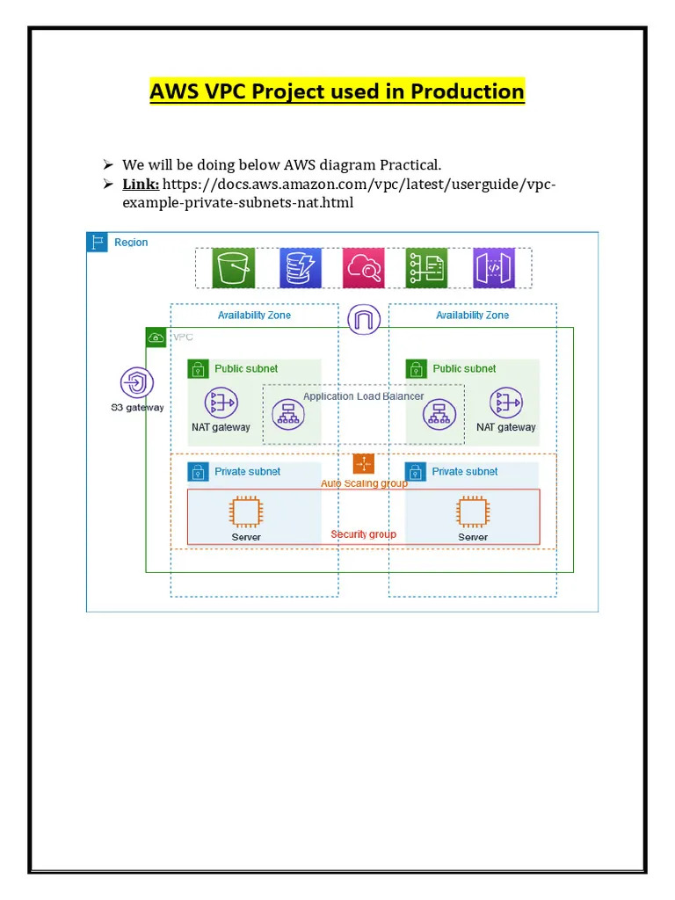
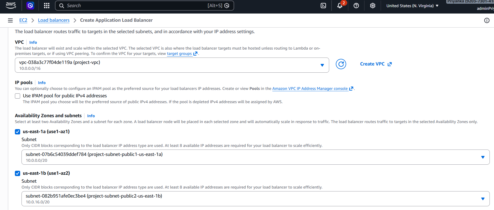
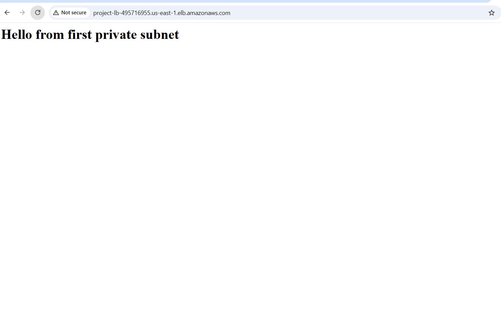
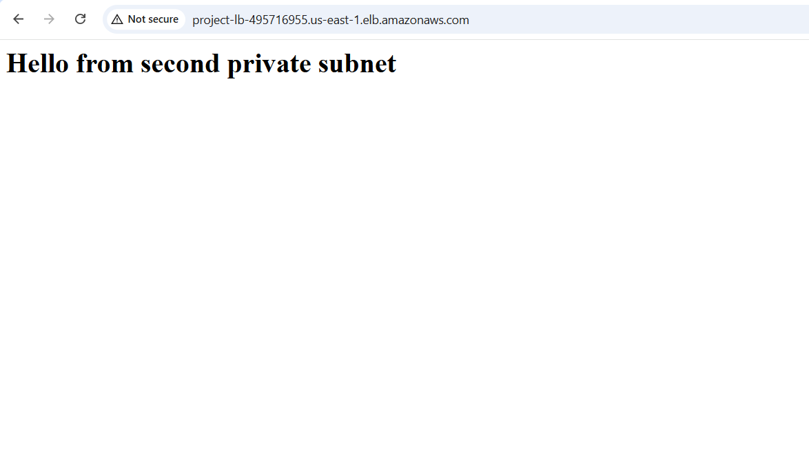

# 🚀 Real-Time Production AWS VPC Architecture with Multi-AZ Deployment
This project focuses on designing and implementing a real-time, production-grade AWS VPC architecture with a Multi-Availability Zone (Multi-AZ) deployment to ensure high availability, fault tolerance, and scalability.

## 🔐 Key Steps overview
- Created VPC
- Created Launch Template in the VPC created
- Created ASG under the same VPC
- Created Bastion Host
- Logged into private EC2 instance from Bastion Host
- Installed the web application in private EC2 instances
- Created Load Balancer in public subnet under the same VPC

## 🔧 Implementation
### Step 1: Create a custom VPC to host the entire infrastructure with proper network isolation.
- VPC Endpoint: None

### Step 2: Create a Launch Template defining EC2 instance configurations such as AMI, instance type, key pair, and security groups
- Security Group configuration:
  - SSH from anywhere
  - HTTP from anywhere
  - TCP: Port 8000 from SG-LB
 
### Step 3: Configure an Auto Scaling Group within the VPC to automatically manage and scale EC2 instances across multiple Availability Zones.
- The EC2 instances must be in private subnet (us-east-1, us-east-2)
- Desired: 2, Minimum: 1, Maximum: 4
- Scaling policies: None
- No Load Balancer in the private subnet, hence select No Load Balancer

Note: Check if the two instances are connected in two different AZs or not.

### Step 4: Create Bastion Host
Deploy a Bastion Host in the public subnet to securely access instances located in private subnets.

- Auto assign public IP: Enable
- Security Group configuration:
  - SSH from anywhere
  - HTTP from anywhere

### Step 5: SSH into private EC2 instance from the Bastion Host
- Step a: Copy the keypair file to public EC2 instance from laptop

`scp -i \mnt\c\Users\preey\Downloads\KeyPairNorth.pem \mnt\c\Users\preey\Downloads\KeyPairNorth.pem ubuntu@<public_ip_address_of_public_ec2>:/home/ubuntu `

- Step b: ssh into public EC2 instance
- Step c: ssh into private EC2 instance from public EC2 instance

`ssh -i KeyPairNorth.pem ubuntu@private_ip_address_of_private_ec2`

### Step 6: Install and configure the web application on EC2 instances running in private subnets

Write simple web content under `vim index.html`

Start a basic HTTP web server in the current directory using `python3 -m http.server 8000`

### Step 7: Create a Load Balancer in the public subnet to distribute incoming traffic across private EC2 instances.
- Security Group configuration:
  - HTTP 80- from anywhere
 
- Target Group configuration:
  - Protocol: HTTP
  - Port: 8000

 

 
### Step 8: Hit the LB DNS into the browser

## It is a great hands-on exercise in IAM, EC2, S3, and AWS CLI, reinforcing how important secure and minimal-access configurations are in cloud engineering.

