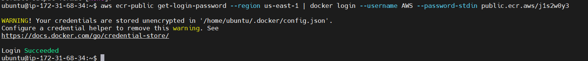

# 🚀 Automate the deployment of NodeJS app on serverless AWS ECS Fargate with the image repository on ECR and Cloudwatch logging integrated with IAM roles and configuration

This project automates the end-to-end deployment pipeline of a Node.js application using AWS serverless container technologies. The entire workflow—from source code to a live, publicly accessible service—is now smooth, scalable, and fully cloud-native.


## 🔐 Deployment Workflow
- Fetch the application code from GitHub: Cloned the latest Node.js application source to prepare it for containerization and deployment.
- Launch an EC2 instance (ecs-demo): Used it as a build environment for Docker and ECR interactions.
- Clone the GitHub repository inside the EC2 instance: Pulled the application source directly onto the EC2 machine.
- Build the Docker image and push it to Amazon ECR
- ECS Deployment
    -  Created an ECS Cluster using AWS Fargate: Serverless compute — no servers to manage.
    -  Defined an ECS Task Definition (Equivalent to docker run)
    -  Ran the Task Definition on the ECS Cluster
    -  Accessed the deployed app
- Verified Logs in CloudWatch


## 🔧 Implementation
### Step 1. Fetch the code from Github.

Code URL: `https://github.com/LondheShubham153/node-todo-cicd.git`

### Step 2: Create an EC2 Instance(named ecs-demo with default settings) and SSH into it.
Note: : Choose Ubuntu AMI for the EC2 instance

### Step 3. Clone the Github code to EC2 instance
`git clone https://github.com/LondheShubham153/node-todo-cicd.git`

### Step 4: Build the Dockerfile and push it to ECR
#### Step a: Create Repository in ECR (named node-app)
- Visibility Settings: Public
- Name: node-app
- Content type:
    - OS: Linux
    - Architecture: Select All
 
#### Step b Install Docker and  AWS CLI on EC2 instance
- Install Docker
```
sudo apt install docker.io -y
sudo usermod -aG docker $USER
sudo reboot
```
- Install AWS CLI:
```
sudo apt update
sudo apt install unzip

curl "https://awscli.amazonaws.com/awscli-exe-linux-x86_64.zip" -o "awscliv2.zip"
unzip awscliv2.zip
sudo ./aws/install

```
- Configure AWS CLI
```
aws --version
aws configure
```
Follow prompts on aws configure, e.g. provide Access Key and Secret Access key etc.

#### Step c: Attach Policy to the IAM User

Click on User -> Permissions -> Add permissions -> Attach Policies directly

- Required permissions:
  - AmazonElasticContainerRegistryPublicFullAccess
  - AmazonElasticContainerRegistryPublicPowerUser
  - AmazonElasticContainerRegistryPublicReadOnly
 
### Step 5: Run the commands given in View Push Commands in ECR


Output


### Step 6: Build the docker image (Run second command)
```
cd node-todo-cicd
ls
docker build -t node-app .
```

### Step 7: After build completes, tag the image (Run third command)
```
docker images
```
Output: Image is tagged


### Step 8: Push the image from EC2 to ECR (Run fourth command)

Output: Image is pushed to ECR

### Step 9: Goto ECS and Create cluster with Infrastructure as Fargate.
- Name: node-app-cluster
- Infrastructure: Fargate
- Monitoring: Use Conatainer Insights

### Step 10: Create Task Definition (Equivalent to docker run command)
- Family: node-todo-app-td
- Infrastructure: AWS Fargate
- Task Size: 2 CPU, 8 GB
- Task Role: ecsTaskExecutionRole
  
   Steps for creating ecsTaskExecutionRole:
    - Goto IAM -> Roles -> Create Role
    - Trusted Entity type: AWS Service
    - Use Case: Elastic Container Service
    - Then pick: Elastic Container Service task (important)
    - Attach Policy: AmazonECSTaskExecutionRolePolicy
    - Give Role Name: ecsTaskExecutionRole

 ### Step 11: Container-1:
 - Name: node-container
 - Image URL: Goto ECR -> View Public Listing -> Copy and Paste the URL (if it doesn't work, go to Details and copy the URL)
 - Port Mappings: 80, 8000
 - Resource Allocation Limit: CPU-2, GPU-1, Maximum hard limit- 8, Maximum soft limit-1

### Step 12: Run Task Definition on cluster
Select Task Definition -> Deploy -> Run task
- Environment: node-app-cluster
- Capacity Provider: Fargate

### Click on the Task, the last status should be running. Goto public IP, then hit publicIP:8000 on browser.
Note: Port 8000 may not run, goto ENI ID from ECS -> Click on it -> Security Groups -> Edit inbound rules -> Add port 8000

### Step 13: Check logs on CloudWatch
- Goto CloudWatch
- Select Log Groups(on the left)
- Click on node-todo-app-td
- Select Log Streams
- Click on Stream
- View Logs


## This project demonstrates fully automated, scalable, serverless deployment pipeline leveraging GitHub → Docker → ECR → ECS Fargate → CloudWatch. This setup improves deployment speed, reliability, and observability while eliminating the need to manage servers manually.


